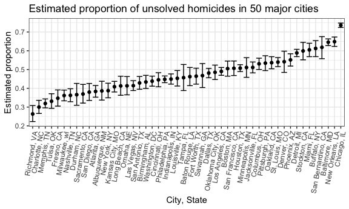

p8105\_hw5\_dry2115
================
Dayoung Yu
2018-11-09

### Problem 1

#### Read and clean the data

``` r
study_data = 
  tibble(file_name = list.files(path = "./data"),
         file_path = str_c("./data/", file_name),
         observations = map(file_path, read_csv)) %>%
  unnest() %>%
  gather(key = week, value = observation, week_1:week_8) %>%
  mutate(subject = str_replace(file_name, ".csv", ""),
         arm = str_sub(file_name, 1, 3),
         week = as.numeric(str_replace(week, "week_", ""))) %>%
  select(subject, arm, week, observation)
```

Separate files containing individual subject data were collected to create a single dataframe. *Week* variables were gathered and a new *subject* variable containing arm and subject id was created. A separate *arm* variable was also created to create groups in plots.

#### Create a spaghetti plot of the data

``` r
study_data %>%
  ggplot(aes(x = week, y = observation, color = subject)) +
  geom_path() + 
  facet_grid(~arm) +
  labs(title = "Observation over time by arm") +
  viridis::scale_color_viridis(
  name = "subject", 
  discrete = TRUE)
```


Above is a plot showing the observations of each subject over time. The plot was faceted to observe the differences in control arm verses experimental arm. We can see that observations in the control group generally remained the same over time while observations in the experimental group increased.

### Problem 2

#### Read and clean homicide data

``` r
url = "https://raw.githubusercontent.com/washingtonpost/data-homicides/master/homicide-data.csv"

homicide_data = read_csv(file = url) %>%
  mutate(city_state = str_c(city, state, sep = ", ")) %>%
  filter(city_state != "Tulsa, AL") %>%
  group_by(city_state, disposition) %>%
  summarize(n = n()) %>% 
  spread(key = disposition, value = n) %>% 
  janitor::clean_names() %>% 
  mutate(
    total_homicides = sum(closed_by_arrest, closed_without_arrest, open_no_arrest, na.rm = TRUE),
    unsolved_homicides = sum(closed_without_arrest, open_no_arrest, na.rm = TRUE)
  ) %>%
  select(city_state, total_homicides, unsolved_homicides)
```

Homicide data of 50 major U.S. cities were read in by url from the *Washington Post* GitHub repository. The raw data was a CSV file containing homicide id, victim name, race, age and sex, date reported, location, and case disposition. Each observation described a homicide incident. The raw data were summarized by city, state and disposition where unsolved homicides were defined as "closed without arrest" or "open no arrest". The one observation at "Tulsa, AL" was filtered out because that city does not exist and was thought to be an error. The recorder may have meant to write "Tulsa, OK", but that assumption could not be made without more evidence.

#### Run a proportion test for Baltimore, MD

``` r
balt_data = homicide_data %>%
  filter(city_state == "Baltimore, MD")
  
balt_prop = broom::tidy(prop.test(balt_data$unsolved_homicides, balt_data$total_homicides)) %>%
  select(estimate, conf.low, conf.high) %>%
  mutate()

balt_prop %>%
  knitr::kable(digits = 3)
```

|  estimate|  conf.low|  conf.high|
|---------:|---------:|----------:|
|     0.646|     0.628|      0.663|

The estimated proportion of unsolved homicides in Baltimore is 0.646, with a 95% confidence interval of (0.628, 0.663). This proportion is unexpectedly high (above 50%), and the confidence interval is narrow, indicating high precision.

#### Run proportion tests for all cities

``` r
prop_tests = homicide_data %>%
  mutate(prop_test = map2(unsolved_homicides, total_homicides, prop.test),
         prop_test = map(prop_test, broom::tidy)) %>%
  unnest() %>%
  select(city_state, estimate, conf.low, conf.high)

prop_tests %>%
  head(5) %>%
  knitr::kable(digits = 3)
```

| city\_state     |  estimate|  conf.low|  conf.high|
|:----------------|---------:|---------:|----------:|
| Albuquerque, NM |     0.386|     0.337|      0.438|
| Atlanta, GA     |     0.383|     0.353|      0.415|
| Baltimore, MD   |     0.646|     0.628|      0.663|
| Baton Rouge, LA |     0.462|     0.414|      0.511|
| Birmingham, AL  |     0.434|     0.399|      0.469|

Proportion tests were conducted for all 50 cities to obtain estimate proportions of unsolved homicides and their 95% confidence intervals. The first 5 cities in the dataframe were printed to illustrate.

#### Create a plot of estimates and CIs for each city

``` r
prop_tests %>%
  ungroup(city_state) %>%
  mutate(city_state = fct_reorder(city_state, estimate)) %>%
  ggplot(aes(x = city_state, y = estimate)) +
  geom_point() +
  geom_errorbar(aes(ymin = conf.low, ymax = conf.high)) +
  theme(axis.text.x = element_text(angle = 80, hjust = 1)) +
  labs(
    title = "Estimated proportion of unsolved homicides in 50 major cities",
    x = "City, State",
    y = "Estimated proportion"
  )
```



Estimated proportions of unsolved homicides and corresponding error bars for 50 major U.S. cities were plotted above. Cities were organized in increasing proportion. Thus, we can see that Richmond, VA had the lowest proportion of unsolved homicides, and Chicago, IL the highest. It is also interesting that Chicago, IL had a significantly higher proportion than the rest of the cities, and the error bar is the shortest, indicating high precision.
