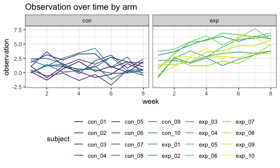

p8105\_hw5\_dry2115
================
Dayoung Yu
2018-11-09

Problem 1
---------

``` r
study_data = 
  tibble(file_name = list.files(path = "./data"),
         file_path = str_c("./data/", file_name),
         observations = map(file_path, read_csv)) %>%
  unnest() %>%
  gather(key = week, value = observation, week_1:week_8) %>%
  mutate(subject = str_replace(file_name, ".csv", ""),
         arm = str_sub(file_name, 1, 3),
         week = str_replace(week, "week_", "")) %>%
  select(subject, arm, week, observation)


  
  

  
### knitr::kable(digits = 2)
```

Problem 2
---------

``` r
url = "https://raw.githubusercontent.com/washingtonpost/data-homicides/master/homicide-data.csv"

homicide_data = read_csv(file = url) %>%
  mutate(city_state = str_c(city, state, sep = ", ")) %>%
  group_by(city_state, disposition) %>%
  summarize(n = n()) %>% 
  spread(key = disposition, value = n) %>% 
  janitor::clean_names() %>% 
  mutate(
    total_homicides = sum(closed_by_arrest, closed_without_arrest, open_no_arrest, na.rm = TRUE),
    unsolved_homicides = sum(closed_without_arrest, open_no_arrest, na.rm = TRUE)
  ) %>%
  select(city_state, total_homicides, unsolved_homicides)
```

    ## Parsed with column specification:
    ## cols(
    ##   uid = col_character(),
    ##   reported_date = col_integer(),
    ##   victim_last = col_character(),
    ##   victim_first = col_character(),
    ##   victim_race = col_character(),
    ##   victim_age = col_character(),
    ##   victim_sex = col_character(),
    ##   city = col_character(),
    ##   state = col_character(),
    ##   lat = col_double(),
    ##   lon = col_double(),
    ##   disposition = col_character()
    ## )

``` r
##### get rid of tulsa alabama 

balt_data = homicide_data %>%
  filter(city_state == "Baltimore, MD")
  
broom::tidy(prop.test(balt_data$unsolved_homicides, balt_data$total_homicides)) %>%
  select(estimate, conf.low, conf.high) 
```

    ## # A tibble: 1 x 3
    ##   estimate conf.low conf.high
    ##      <dbl>    <dbl>     <dbl>
    ## 1    0.646    0.628     0.663

``` r
prop_tests = homicide_data %>%
  mutate(prop_test = map2(unsolved_homicides, total_homicides, prop.test),
         prop_test = map(prop_test, broom::tidy)) %>%
  unnest() %>%
  select(city_state, estimate, conf.low, conf.high)
```

    ## Warning in .f(.x[[1L]], .y[[1L]], ...): Chi-squared approximation may be
    ## incorrect

``` r
prop_tests %>%
  ungroup(city_state) %>%
  mutate(city_state = fct_reorder(city_state, estimate)) %>%
  ggplot(aes(x = city_state, y = estimate)) +
  geom_point() +
  geom_errorbar(aes(ymin = conf.low, ymax = conf.high))
```


